# Design Document

## Overview

The Chess RL Bot system consists of four modular Kotlin packages that work together to enable production-ready reinforcement learning for chess. The system is optimized for JVM performance during training with native compilation capability for deployment scenarios.

### Architecture Principles (Updated Based on Implementation Experience)
- **Modular Design**: Four independent packages with well-defined interfaces and comprehensive testing
- **Performance Optimization**: JVM-first approach for training (5-8x faster), native compilation for deployment
- **Production Readiness**: Comprehensive error handling, monitoring, and recovery mechanisms
- **Scalability**: Efficient batch processing, memory management, and concurrent training support
- **Testability**: 166+ tests with integration, unit, performance, and robustness validation
- **Extensibility**: Proven modular architecture supporting multiple RL algorithms and chess variants
- **Debugging & Validation**: Sophisticated training validation and debugging tools for production use

## Architecture

### Production-Ready System Architecture

```mermaid
graph TB
    subgraph "Chess RL Bot System - Production Architecture"
        subgraph "Neural Network Package (Production Ready)"
            NN[Advanced Neural Networks]
            OPT[Multiple Optimizers: Adam, RMSprop, SGD]
            LOSS[Loss Functions: MSE, CrossEntropy, Huber]
            REG[Regularization: L1/L2, Dropout]
            BATCH[Efficient Batch Processing]
        end
        
        subgraph "RL Framework (Production Ready)"
            DQN[DQN Algorithm with Target Networks]
            PG[Policy Gradient: REINFORCE]
            EXP[Experience Replay: Circular, Prioritized]
            EXPL[Exploration: Epsilon-Greedy, Boltzmann]
            VAL[Training Validation & Issue Detection]
        end
        
        subgraph "Chess Engine (Production Ready)"
            BOARD[Complete Chess Implementation]
            RULES[Full Rule Validation & Special Moves]
            STATE[Game State Detection: Checkmate, Stalemate]
            FEN[FEN/PGN Support & Notation]
            VIS[Board Visualization & Analysis]
        end
        
        subgraph "Integration Layer (Production Ready)"
            AGENT[ChessAgent: Neural RL Agent]
            ENV[ChessEnvironment: 776-feature encoding]
            PIPELINE[ChessTrainingPipeline: Batch Training]
            CTRL[TrainingController: High-level Management]
            METRICS[Enhanced Episode Tracking & Analytics]
        end
        
        subgraph "Self-Play System (Task 9)"
            SELFPLAY[SelfPlaySystem: Concurrent Games]
            COLLECT[Experience Collection: Multi-strategy]
            QUALITY[Game Quality Analysis]
            PARALLEL[Parallel Training Support]
        end
        
        subgraph "Training Interface (Tasks 10-11)"
            UI[Interactive Training Interface]
            DEBUG[Manual Validation & Debugging Tools]
            VIZ[Real-time Visualization & Analysis]
            PROF[Performance Profiling & Optimization]
        end
        
        subgraph "Performance & Monitoring"
            JVM[JVM Optimization: 5-8x Training Speed]
            NATIVE[Native Compilation: Deployment]
            MON[Comprehensive Monitoring & Metrics]
            ERR[Error Handling & Recovery]
        end
    end
    
    NN --> DQN
    NN --> PG
    BOARD --> ENV
    DQN --> AGENT
    PG --> AGENT
    ENV --> PIPELINE
    AGENT --> PIPELINE
    PIPELINE --> CTRL
    CTRL --> SELFPLAY
    SELFPLAY --> UI
    METRICS --> DEBUG
    JVM --> MON
```



### Package Dependencies (Updated)
- **Neural Network Package**: Standalone with comprehensive training infrastructure
- **RL Framework**: Depends on Neural Network Package for algorithm implementation
- **Chess Engine**: Standalone with complete chess rule implementation
- **Integration Layer**: Depends on all three packages, provides chess-specific RL integration
- **Self-Play System**: Depends on Integration Layer for advanced training scenarios
- **Training Interface**: Depends on Integration and Self-Play for comprehensive training management

## Implementation Experience & Architectural Insights

### Key Learnings from Tasks 1-8 Implementation

#### ✅ **Successful Architectural Decisions**
1. **Modular Package Structure**: 4-package architecture proved excellent for independent development and testing
2. **JVM Performance Focus**: Benchmarking confirmed 5-8x training speed advantage over native compilation
3. **Comprehensive Testing Strategy**: 166+ tests provided robust validation and caught integration issues early
4. **Enhanced Episode Tracking**: Detailed termination reason tracking (game ended, step limit, manual) proved invaluable for debugging
5. **Flexible RL Framework**: Support for both DQN and Policy Gradient algorithms enabled experimentation
6. **Efficient State/Action Encoding**: 776-feature state encoding and 4096 action space work effectively for chess

#### 🔄 **Architectural Refinements Made**
1. **Episode Management**: Added `completeEpisodeManually()` for external episode management by training pipelines
2. **Batch Training Optimization**: Implemented multiple sampling strategies (UNIFORM, RECENT, MIXED) for diverse experience collection
3. **Training Validation Framework**: Added comprehensive policy update validation and training issue detection
4. **Memory Management**: Implemented circular buffers with configurable cleanup for large-scale training
5. **Error Handling**: Enhanced error recovery mechanisms based on real training scenarios encountered

#### ⚠️ **Risks Identified for Tasks 9-11**
1. **Self-Play Complexity**: More sophisticated than originally estimated - requires concurrent game management, advanced experience collection
2. **Training Stability**: Need robust convergence detection and automated recovery from training issues
3. **Scalability Requirements**: Large-scale training needs careful memory management and performance optimization
4. **User Interface Complexity**: Training interface needs to be more sophisticated than originally planned for production use

### Updated Architecture Strategy

#### **Performance-First Design**
- **JVM Training Target**: All training operations optimized for JVM performance
- **Native Deployment Target**: Native compilation reserved for deployment scenarios
- **Batch Processing**: Optimized for 32-128 batch sizes with efficient memory management
- **Concurrent Training**: Support for parallel self-play games with configurable parallelism

#### **Production Readiness Focus**
- **Comprehensive Monitoring**: Real-time metrics, performance tracking, resource utilization
- **Robust Error Handling**: Automated issue detection, recovery mechanisms, diagnostic tools
- **Training Validation**: Sophisticated validation framework for training quality assurance
- **Debugging Tools**: Manual validation tools, interactive analysis, neural network visualization

## Components and Interfaces

### 1. Neural Network Package (`nn-package`)

#### Core Components

**Complete Training-Ready Neural Network**
```kotlin
interface NeuralNetwork {
    // Forward and backward propagation
    fun forward(input: DoubleArray): DoubleArray
    fun backward(target: DoubleArray): DoubleArray  // Returns loss
    fun backwardWithGradients(outputGradients: DoubleArray): DoubleArray  // For RL policy gradients
    
    // Training utilities
    fun train(dataset: Dataset, epochs: Int, batchSize: Int): TrainingHistory
    fun evaluate(testData: Dataset): EvaluationMetrics
    fun predict(input: DoubleArray): DoubleArray
    
    // Optimization and regularization
    fun setOptimizer(optimizer: Optimizer)
    fun setLossFunction(lossFunction: LossFunction)
    fun addRegularization(regularization: Regularization)
    
    // Model management
    fun getWeights(): NetworkWeights
    fun setWeights(weights: NetworkWeights)
    fun clone(): NeuralNetwork  // For target networks in RL
    fun save(path: String)
    fun load(path: String)
}

// Complete training infrastructure
interface Dataset {
    fun getBatch(batchSize: Int): Batch
    fun shuffle()
    fun size(): Int
}

data class Batch(
    val inputs: Array<DoubleArray>,
    val targets: Array<DoubleArray>
)

interface Optimizer {
    fun updateWeights(weights: NetworkWeights, gradients: NetworkWeights, learningRate: Double)
}

// Implementations: SGD, Adam, RMSprop
class AdamOptimizer(
    private val beta1: Double = 0.9,
    private val beta2: Double = 0.999,
    private val epsilon: Double = 1e-8
) : Optimizer

interface LossFunction {
    fun computeLoss(predicted: DoubleArray, target: DoubleArray): Double
    fun computeGradient(predicted: DoubleArray, target: DoubleArray): DoubleArray
}

// Implementations: MSE, CrossEntropy, Huber (for RL)
```

**Layer Implementation**
```kotlin
interface Layer {
    fun forward(input: DoubleArray): DoubleArray
    fun backward(gradient: DoubleArray): DoubleArray
    fun updateWeights(learningRate: Double)
}

class DenseLayer(
    inputSize: Int,
    outputSize: Int,
    activation: ActivationFunction
) : Layer
```

**Activation Functions**
```kotlin
interface ActivationFunction {
    fun activate(x: Double): Double
    fun derivative(x: Double): Double
}

// Implementations: ReLU, Sigmoid, Tanh, Linear
```

#### Key Design Decisions
- **Matrix Operations**: Custom implementation for Kotlin/Native compatibility
- **Weight Initialization**: Xavier/He initialization for stable training
- **Gradient Computation**: Automatic differentiation through backpropagation
- **Memory Management**: Efficient array reuse to minimize allocations

### 2. Chess Implementation (`chess-engine`)

#### Core Components

**Board Representation**
```kotlin
data class ChessBoard(
    private val pieces: Array<Array<Piece?>> = Array(8) { Array(8) { null } },
    private val gameState: GameState = GameState()
) {
    fun makeMove(move: Move): MoveResult
    fun getAllValidMoves(color: PieceColor): List<Move>
    fun isInCheck(color: PieceColor): Boolean
    fun isCheckmate(color: PieceColor): Boolean
    fun isStalemate(color: PieceColor): Boolean
    fun toFEN(): String
    fun fromFEN(fen: String)
}
```

**Move Validation**
```kotlin
interface MoveValidator {
    fun isValidMove(board: ChessBoard, move: Move): Boolean
    fun getValidMoves(board: ChessBoard, position: Position): List<Move>
}

// Piece-specific validators: PawnValidator, RookValidator, etc.
```

**Chess API**
```kotlin
interface ChessGame {
    fun startNewGame()
    fun makeMove(move: Move): MoveResult
    fun getCurrentPosition(): ChessBoard
    fun getGameStatus(): GameStatus
    fun getValidMoves(): List<Move>
    fun undoMove()
    fun getGameHistory(): List<Move>
}
```

**PGN Support**
```kotlin
interface PGNParser {
    fun parseGame(pgn: String): List<Move>
    fun parseDatabase(pgnFile: String): List<List<Move>>
    fun gameToFEN(moves: List<Move>): List<String>
}
```

#### Key Design Decisions
- **Board Representation**: 8x8 array for simplicity and performance
- **Move Encoding**: Algebraic notation with internal coordinate system
- **Game State**: Separate tracking of castling rights, en passant, etc.
- **Validation Strategy**: Piece-specific validators with common interface

### 3. RL Microframework (`rl-framework`)

#### Core Components

**Environment Interface**
```kotlin
interface Environment<S, A> {
    fun reset(): S
    fun step(action: A): StepResult<S>
    fun getValidActions(state: S): List<A>
    fun isTerminal(state: S): Boolean
    fun getStateSize(): Int
    fun getActionSize(): Int
}

data class StepResult<S>(
    val nextState: S,
    val reward: Double,
    val done: Boolean,
    val info: Map<String, Any> = emptyMap()
)
```

**Agent Interface**
```kotlin
interface Agent<S, A> {
    fun selectAction(state: S, validActions: List<A>): A
    fun learn(experience: Experience<S, A>)
    fun setExplorationRate(epsilon: Double)
    fun save(path: String)
    fun load(path: String)
}

data class Experience<S, A>(
    val state: S,
    val action: A,
    val reward: Double,
    val nextState: S,
    val done: Boolean
)
```

**RL Algorithms with Detailed Policy Updates**
```kotlin
interface RLAlgorithm<S, A> {
    // Core RL operations
    fun updatePolicy(experiences: List<Experience<S, A>>): PolicyUpdateResult
    fun getActionValues(state: S, validActions: List<A>): Map<A, Double>
    fun getActionProbabilities(state: S, validActions: List<A>): Map<A, Double>
    
    // Training control
    fun setLearningRate(rate: Double)
    fun setExplorationStrategy(strategy: ExplorationStrategy)
    fun getTrainingMetrics(): RLMetrics
}

data class PolicyUpdateResult(
    val loss: Double,
    val gradientNorm: Double,
    val policyEntropy: Double,
    val valueError: Double? = null  // For actor-critic methods
)

class DQNAlgorithm(
    private val qNetwork: NeuralNetwork,
    private val targetNetwork: NeuralNetwork,
    private val experienceReplay: ExperienceReplay<DoubleArray, Int>
) : RLAlgorithm<DoubleArray, Int> {
    
    override fun updatePolicy(experiences: List<Experience<DoubleArray, Int>>): PolicyUpdateResult {
        // Detailed DQN update with target network, experience replay, etc.
        val batch = experienceReplay.sample(batchSize)
        
        // Compute Q-targets using target network
        val qTargets = computeQTargets(batch)
        
        // Train main network
        val trainingBatch = createTrainingBatch(batch, qTargets)
        val trainingResult = qNetwork.train(trainingBatch, epochs = 1, batchSize = batch.size)
        
        // Update target network periodically
        if (shouldUpdateTargetNetwork()) {
            updateTargetNetwork()
        }
        
        return PolicyUpdateResult(
            loss = trainingResult.finalLoss,
            gradientNorm = trainingResult.gradientNorm,
            policyEntropy = calculatePolicyEntropy(batch)
        )
    }
    
    private fun computeQTargets(batch: List<Experience<DoubleArray, Int>>): Array<DoubleArray> {
        // Bellman equation: Q(s,a) = r + γ * max_a' Q(s',a')
        return batch.map { experience ->
            val nextQValues = if (experience.done) {
                doubleArrayOf(experience.reward)
            } else {
                val nextStateValues = targetNetwork.predict(experience.nextState)
                doubleArrayOf(experience.reward + gamma * nextStateValues.maxOrNull()!!)
            }
            nextQValues
        }.toTypedArray()
    }
}

// Policy Gradient Algorithm for comparison/alternative
class PolicyGradientAlgorithm(
    private val policyNetwork: NeuralNetwork,
    private val valueNetwork: NeuralNetwork? = null  // Optional baseline
) : RLAlgorithm<DoubleArray, Int> {
    
    override fun updatePolicy(experiences: List<Experience<DoubleArray, Int>>): PolicyUpdateResult {
        // REINFORCE or Actor-Critic policy update
        val returns = calculateReturns(experiences)
        val baselines = valueNetwork?.let { vNet ->
            experiences.map { vNet.predict(it.state)[0] }
        } ?: List(experiences.size) { 0.0 }
        
        val advantages = returns.zip(baselines) { ret, baseline -> ret - baseline }
        
        // Policy gradient update
        val policyLoss = updatePolicyNetwork(experiences, advantages)
        
        // Value network update (if using baseline)
        val valueLoss = valueNetwork?.let { vNet ->
            updateValueNetwork(experiences, returns)
        } ?: 0.0
        
        return PolicyUpdateResult(
            loss = policyLoss,
            gradientNorm = calculateGradientNorm(),
            policyEntropy = calculatePolicyEntropy(experiences),
            valueError = valueLoss
        )
    }
}
```

#### Key Design Decisions
- **Generic Design**: Type parameters for state and action spaces
- **Experience Replay**: Buffer for storing and sampling experiences with prioritization
- **Target Networks**: Separate target network for stable Q-learning with soft/hard updates
- **Exploration Strategy**: Multiple strategies (epsilon-greedy, UCB, Thompson sampling)
- **Policy Update Validation**: Detailed metrics to verify learning progress
- **Algorithm Flexibility**: Support for both value-based (DQN) and policy-based (REINFORCE) methods

#### RL Training Validation Framework
```kotlin
interface RLValidator {
    fun validatePolicyUpdate(
        beforeMetrics: RLMetrics,
        afterMetrics: RLMetrics,
        updateResult: PolicyUpdateResult
    ): ValidationResult
    
    fun validateConvergence(trainingHistory: List<RLMetrics>): ConvergenceStatus
    fun detectTrainingIssues(metrics: RLMetrics): List<TrainingIssue>
}

data class ValidationResult(
    val isValid: Boolean,
    val issues: List<String>,
    val recommendations: List<String>
)

enum class TrainingIssue {
    EXPLODING_GRADIENTS,
    VANISHING_GRADIENTS,
    POLICY_COLLAPSE,
    VALUE_OVERESTIMATION,
    EXPLORATION_INSUFFICIENT,
    LEARNING_RATE_TOO_HIGH,
    LEARNING_RATE_TOO_LOW
}

// Specific chess RL validation
class ChessRLValidator : RLValidator {
    fun validateChessSpecificMetrics(
        gameResults: List<GameResult>,
        policyEntropy: Double,
        averageGameLength: Double
    ): ChessValidationResult
}
```

### 4. Integration Layer

#### Chess Environment Implementation
```kotlin
class ChessEnvironment : Environment<DoubleArray, Int> {
    private val chessGame: ChessGame
    private val stateEncoder: ChessStateEncoder
    private val actionDecoder: ChessActionDecoder
    
    override fun reset(): DoubleArray {
        chessGame.startNewGame()
        return stateEncoder.encode(chessGame.getCurrentPosition())
    }
    
    override fun step(action: Int): StepResult<DoubleArray> {
        val move = actionDecoder.decode(action, chessGame.getValidMoves())
        val result = chessGame.makeMove(move)
        return StepResult(
            nextState = stateEncoder.encode(chessGame.getCurrentPosition()),
            reward = calculateReward(result),
            done = chessGame.getGameStatus().isGameOver
        )
    }
}
```

#### State Encoding Strategy
- **Board Representation**: 8x8x12 tensor (6 piece types × 2 colors)
- **Additional Features**: Castling rights, en passant, move count
- **Normalization**: Values scaled to [-1, 1] range
- **Total Input Size**: 768 + 7 = 775 features

#### Action Encoding Strategy
- **Move Representation**: From-square (64) × To-square (64) = 4096 possible moves
- **Promotion Handling**: Additional encoding for pawn promotion pieces
- **Action Masking**: Only valid moves considered during action selection

## Data Models

### Core Data Structures

```kotlin
// Chess Domain
data class Position(val rank: Int, val file: Int)
data class Move(val from: Position, val to: Position, val promotion: PieceType? = null)
data class Piece(val type: PieceType, val color: PieceColor)

enum class PieceType { PAWN, ROOK, KNIGHT, BISHOP, QUEEN, KING }
enum class PieceColor { WHITE, BLACK }

// Neural Network Domain
data class NetworkConfig(
    val inputSize: Int,
    val hiddenLayers: List<Int>,
    val outputSize: Int,
    val learningRate: Double,
    val activationFunction: ActivationFunction
)

// RL Domain
data class TrainingConfig(
    val episodes: Int,
    val maxStepsPerEpisode: Int,
    val explorationRate: Double,
    val explorationDecay: Double,
    val batchSize: Int,
    val targetUpdateFrequency: Int
)
```

## Error Handling

### Error Categories and Strategies

**Chess Engine Errors**
- **Invalid Moves**: Return error result with explanation
- **Illegal Positions**: Validate FEN strings and board states
- **PGN Parsing**: Handle malformed notation gracefully

**Neural Network Errors**
- **Numerical Instability**: Gradient clipping and learning rate adjustment
- **Dimension Mismatches**: Runtime validation of input/output sizes
- **Memory Issues**: Efficient tensor operations and cleanup

**RL Training Errors**
- **Convergence Issues**: Early stopping and learning rate scheduling
- **Experience Buffer**: Handle memory limits and data corruption
- **Action Selection**: Fallback to random valid moves

**Integration Errors**
- **State Encoding**: Validate chess position to neural network input conversion
- **Action Decoding**: Ensure neural network outputs map to valid chess moves
- **Component Communication**: Clear error propagation between modules

### Error Recovery Mechanisms
```kotlin
sealed class ChessRLError : Exception() {
    data class InvalidMove(val move: Move, val reason: String) : ChessRLError()
    data class NetworkError(val operation: String, val cause: Throwable) : ChessRLError()
    data class TrainingError(val episode: Int, val cause: Throwable) : ChessRLError()
}

interface ErrorHandler {
    fun handleError(error: ChessRLError): RecoveryAction
}

enum class RecoveryAction { RETRY, SKIP, ABORT, FALLBACK }
```

## Testing Strategy

### Unit Testing Approach

**Chess Engine Testing**
- **Move Validation**: Comprehensive test cases for all piece types
- **Game Rules**: Test checkmate, stalemate, and draw detection
- **PGN Parsing**: Validate against standard chess databases
- **Performance**: Benchmark move generation and validation speed

**Neural Network Testing**
- **Forward Pass**: Verify output dimensions and value ranges
- **Backward Pass**: Test gradient computation with numerical differentiation
- **Training Completeness**: Test full training pipeline with various datasets:
  - XOR problem (classification)
  - Polynomial regression (regression)
  - MNIST subset (if needed for validation)
- **Optimization**: Test different optimizers (SGD, Adam) on known problems
- **Loss Functions**: Validate MSE, CrossEntropy, Huber loss implementations
- **Regularization**: Test L1/L2 regularization and dropout
- **Serialization**: Test save/load functionality with trained models

**RL Framework Testing**
- **Environment Interface**: Test with simple grid world environment
- **Agent Behavior**: Verify exploration/exploitation balance with metrics
- **Experience Replay**: Test buffer operations, sampling, and prioritization
- **Algorithm Correctness**: 
  - DQN on CartPole or simple grid world
  - Policy Gradient on bandit problems
  - Compare learning curves against known benchmarks
- **Policy Update Validation**:
  - Verify Bellman equation implementation
  - Test gradient computation for policy methods
  - Validate target network updates
  - Check exploration strategy effectiveness
- **Training Stability**:
  - Test with different learning rates
  - Verify convergence detection
  - Test recovery from training issues

### Integration Testing

**Component Integration**
- **Chess-RL Integration**: Test state encoding/action decoding
- **Network-Agent Integration**: Verify neural network integration
- **Self-Play Testing**: Run short games to validate complete pipeline

**End-to-End Testing**
- **Training Pipeline**: Run abbreviated training sessions
- **Performance Monitoring**: Verify metrics collection and reporting
- **Error Handling**: Test recovery from various failure scenarios

### Test Data and Fixtures
- **Chess Positions**: Standard tactical puzzles and endgame positions
- **PGN Games**: Small database of master games for validation
- **Neural Network**: Pre-trained weights for regression testing
- **RL Scenarios**: Deterministic environments for algorithm validation

This design provides a solid foundation for incremental development, starting with the simple components and building up to the complex integrations while maintaining modularity and testability throughout.