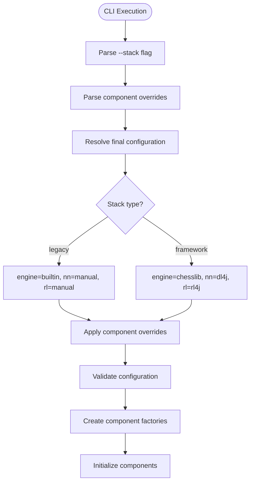
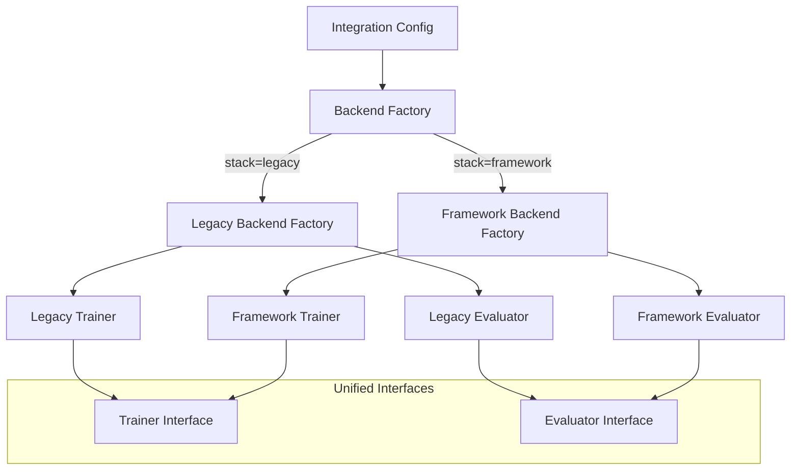

# Design Document

## Overview

This design implements a comprehensive framework stack migration that provides users with a choice between a legacy custom implementation and a mature framework-based implementation. The system introduces a `--stack legacy|framework` flag that switches the entire pipeline while maintaining full backward compatibility and allowing granular component overrides.

The design follows a pluggable architecture where each component (chess engine, neural network, RL algorithm) can be independently selected and configured. The framework stack leverages chesslib for chess logic, DL4J for neural networks, and RL4J for reinforcement learning, while the legacy stack preserves the existing custom implementations.

## Architecture

### High-Level Stack Architecture

```mermaid
graph TB
    CLI[Chess RL CLI] --> StackSelector[Stack Selector]
    StackSelector --> |--stack legacy| LegacyStack[Legacy Stack]
    StackSelector --> |--stack framework| FrameworkStack[Framework Stack]
    
    subgraph "Legacy Stack"
        LegacyEngine[Builtin Chess Engine]
        LegacyNN[Manual Neural Network]
        LegacyRL[Manual DQN]
        LegacyEngine --> LegacyNN
        LegacyNN --> LegacyRL
    end
    
    subgraph "Framework Stack"
        ChessLib[Chesslib Engine]
        DL4J[DL4J Neural Network]
        RL4J[RL4J Algorithms]
        ChessLib --> DL4J
        DL4J --> RL4J
    end
    
    subgraph "Component Overrides"
        EngineOverride[--engine builtin|chesslib]
        NNOverride[--nn manual|dl4j]
        RLOverride[--rl manual|rl4j]
    end
    
    EngineOverride -.-> LegacyEngine
    EngineOverride -.-> ChessLib
    NNOverride -.-> LegacyNN
    NNOverride -.-> DL4J
    RLOverride -.-> LegacyRL
    RLOverride -.-> RL4J
```

### Configuration Resolution Flow



### Component Factory Architecture



## Components and Interfaces

### 1. Stack Selection and Configuration

**Component**: `StackSelector` and `IntegrationConfig`
- **Purpose**: Parse CLI flags and resolve final component configuration
- **Interface**: 
```kotlin
data class IntegrationConfig(
    val stack: StackType,
    val engine: EngineType,
    val neuralNetwork: NeuralNetworkType,
    val reinforcementLearning: RLType,
    val profileConfig: ChessRLConfig,
    // ... other configuration fields
)

enum class StackType { LEGACY, FRAMEWORK }
enum class EngineType { BUILTIN, CHESSLIB }
enum class NeuralNetworkType { MANUAL, DL4J }
enum class RLType { MANUAL, RL4J }
```

**Resolution Logic**:
1. Parse `--stack` flag (default: LEGACY)
2. Set component defaults based on stack type
3. Apply explicit component overrides (`--engine`, `--nn`, `--rl`)
4. Validate configuration compatibility
5. Merge with profile configuration

### 2. Chess Engine Abstraction

**Component**: `ChessEngineAdapter` interface with implementations
- **Purpose**: Provide unified chess engine interface across builtin and chesslib
- **Interface**:
```kotlin
interface ChessEngineAdapter {
    fun getLegalMoves(fen: String): List<ChessMove>
    fun applyMove(fen: String, move: ChessMove): String
    fun getGameOutcome(fen: String): GameOutcome?
    fun isValidMove(fen: String, move: ChessMove): Boolean
}

data class ChessMove(
    val from: Square,
    val to: Square,
    val promotion: PieceType? = null
)

sealed class GameOutcome {
    object WhiteWins : GameOutcome()
    object BlackWins : GameOutcome()
    object Draw : GameOutcome()
}
```

**Implementations**:
- `BuiltinEngineAdapter`: Wraps existing chess engine implementation
- `ChesslibEngineAdapter`: Integrates with chesslib for move generation and validation

### 3. Observation and Action Encoding

**Component**: `ObservationEncoder` and `ActionAdapter`
- **Purpose**: Maintain consistent 839-dimensional observations and 4096-dimensional actions
- **Interface**:
```kotlin
interface ObservationEncoder {
    fun encode(fen: String): DoubleArray // Size 839
}

interface ActionAdapter {
    fun moveToActionId(move: ChessMove): Int // 0-4095
    fun actionIdToMove(actionId: Int): ChessMove
    fun getLegalActionIds(fen: String, engine: ChessEngineAdapter): List<Int>
}
```

**Implementation**: Reuse existing encoding logic with adapter pattern for framework compatibility

### 4. Backend Factory System

**Component**: `BackendFactory` with stack-specific implementations
- **Purpose**: Create trainers and evaluators based on resolved configuration
- **Interface**:
```kotlin
interface BackendFactory {
    fun createTrainer(config: IntegrationConfig): Trainer
    fun createEvaluator(config: IntegrationConfig): Evaluator
}

class LegacyBackendFactory : BackendFactory {
    override fun createTrainer(config: IntegrationConfig): Trainer {
        // Create trainer using existing DQN/NN implementation
    }
}

class FrameworkBackendFactory : BackendFactory {
    override fun createTrainer(config: IntegrationConfig): Trainer {
        // Create trainer using RL4J/DL4J implementation
    }
}
```

### 5. Framework Stack Components

#### 5.1 DL4J Neural Network Integration

**Component**: `DL4JNeuralNetwork`
- **Purpose**: Wrap DL4J MultiLayerNetwork for chess RL
- **Architecture**: 839 → hidden layers → 4096 output
- **Configuration**: Map from existing NN parameters to DL4J configuration
- **Interface**: Compatible with existing neural network interface

#### 5.2 RL4J Integration

**Component**: `ChessMDP` and `RL4JTrainer`
- **Purpose**: Adapt chess environment to RL4J MDP interface
- **Key Features**:
  - Custom MDP implementation for chess
  - QLearningDiscreteDense with DQN factory
  - Action masking for legal move enforcement
  - Configuration mapping from existing RL parameters

#### 5.3 Chesslib Engine Integration

**Component**: `ChesslibEngineAdapter`
- **Purpose**: Leverage chesslib for robust chess logic
- **Features**:
  - Legal move generation
  - Position evaluation
  - Game outcome detection
  - FEN parsing and generation

### 6. Action Masking System

**Component**: Two-phase masking implementation
- **Phase 1 (Fallback)**: Detect illegal actions and select legal fallback
- **Phase 2 (Policy Masking)**: Mask illegal actions before policy selection
- **Implementation**:
```kotlin
class MaskedPolicy(
    private val basePolicy: Policy,
    private val actionAdapter: ActionAdapter,
    private val engine: ChessEngineAdapter
) : Policy {
    override fun selectAction(observation: Observation, qValues: INDArray): Int {
        val legalActions = actionAdapter.getLegalActionIds(observation.fen, engine)
        val maskedQValues = qValues.dup()
        
        // Mask illegal actions
        for (i in 0 until qValues.length()) {
            if (i !in legalActions) {
                maskedQValues.putScalar(i, Double.NEGATIVE_INFINITY)
            }
        }
        
        return basePolicy.selectAction(observation, maskedQValues)
    }
}
```

### 7. Unified Checkpoint Management

**Component**: `CheckpointManagerAdapter`
- **Purpose**: Handle both .json (legacy) and .zip (framework) model formats
- **Features**:
  - Automatic format detection
  - Metadata generation with stack information
  - Best model promotion logic
  - Cross-stack model loading validation

**Implementation**:
```kotlin
class CheckpointManagerAdapter(
    private val config: IntegrationConfig
) {
    fun saveCheckpoint(model: Any, metadata: CheckpointMetadata): String {
        return when (config.neuralNetwork) {
            NeuralNetworkType.MANUAL -> saveJsonCheckpoint(model, metadata)
            NeuralNetworkType.DL4J -> saveZipCheckpoint(model, metadata)
        }
    }
    
    fun loadCheckpoint(path: String): Pair<Any, CheckpointMetadata> {
        return when {
            path.endsWith(".json") -> loadJsonCheckpoint(path)
            path.endsWith(".zip") -> loadZipCheckpoint(path)
            else -> throw IllegalArgumentException("Unknown checkpoint format")
        }
    }
}
```

## Data Models

### Configuration Data Models

```kotlin
data class IntegrationConfig(
    val stack: StackType,
    val engine: EngineType,
    val neuralNetwork: NeuralNetworkType,
    val reinforcementLearning: RLType,
    val profileConfig: ChessRLConfig,
    val overrides: ComponentOverrides
) {
    companion object {
        fun resolve(
            stackFlag: String?,
            engineFlag: String?,
            nnFlag: String?,
            rlFlag: String?,
            profileConfig: ChessRLConfig
        ): IntegrationConfig {
            val stack = StackType.valueOf(stackFlag?.uppercase() ?: "LEGACY")
            
            // Set defaults based on stack
            val (defaultEngine, defaultNN, defaultRL) = when (stack) {
                StackType.LEGACY -> Triple(EngineType.BUILTIN, NeuralNetworkType.MANUAL, RLType.MANUAL)
                StackType.FRAMEWORK -> Triple(EngineType.CHESSLIB, NeuralNetworkType.DL4J, RLType.RL4J)
            }
            
            // Apply overrides
            val engine = engineFlag?.let { EngineType.valueOf(it.uppercase()) } ?: defaultEngine
            val nn = nnFlag?.let { NeuralNetworkType.valueOf(it.uppercase()) } ?: defaultNN
            val rl = rlFlag?.let { RLType.valueOf(it.uppercase()) } ?: defaultRL
            
            return IntegrationConfig(stack, engine, nn, rl, profileConfig, ComponentOverrides())
        }
    }
}
```

### Checkpoint Metadata

```kotlin
data class CheckpointMetadata(
    val stackType: StackType,
    val engineType: EngineType,
    val neuralNetworkType: NeuralNetworkType,
    val reinforcementLearningType: RLType,
    val version: String,
    val timestamp: Long,
    val performanceMetrics: Map<String, Double>,
    val configurationHash: String
)
```

### Training and Evaluation Interfaces

```kotlin
interface Trainer {
    fun train(cycles: Int): TrainingReport
    fun saveCheckpoint(path: String): CheckpointMetadata
    fun loadCheckpoint(path: String): CheckpointMetadata
}

interface Evaluator {
    fun evaluateBaseline(config: EvaluationConfig): EvaluationReport
    fun evaluateHeadToHead(config: H2HConfig): H2HReport
}

data class TrainingReport(
    val cyclesCompleted: Int,
    val bestModelPath: String?,
    val metrics: Map<String, Double>,
    val checkpoints: List<String>
)
```

## Error Handling

### Configuration Validation

1. **Stack Compatibility**: Validate that component overrides are compatible
2. **Dependency Checking**: Verify framework dependencies are available
3. **Parameter Validation**: Ensure configuration parameters are within valid ranges
4. **Graceful Degradation**: Fall back to legacy stack if framework initialization fails

### Runtime Error Handling

1. **Illegal Action Detection**: Monitor and handle illegal actions across all stacks
2. **Model Loading Errors**: Provide clear error messages for incompatible model formats
3. **Training Interruption**: Handle graceful shutdown and checkpoint saving
4. **Memory Management**: Monitor and handle out-of-memory conditions

### Cross-Stack Compatibility

1. **Model Format Validation**: Prevent loading incompatible models
2. **Configuration Migration**: Assist users in migrating configurations between stacks
3. **Performance Monitoring**: Alert users to significant performance differences

## Testing Strategy

### Unit Tests

1. **Configuration Resolution**:
   - Stack flag parsing and default resolution
   - Component override application
   - Configuration validation and error handling

2. **Engine Adapters**:
   - Legal move generation consistency
   - FEN parsing and game state management
   - Outcome detection accuracy

3. **Action Masking**:
   - Illegal action detection and masking
   - Policy wrapper correctness
   - Performance impact measurement

### Integration Tests

1. **End-to-End Training**:
   - Complete training cycles for both stacks
   - Checkpoint saving and loading
   - Metrics collection and reporting

2. **Cross-Stack Compatibility**:
   - Model evaluation across different stacks
   - Configuration migration testing
   - Performance parity validation

3. **CLI Integration**:
   - Flag parsing and routing
   - Error message clarity
   - Help text accuracy

### Performance Tests

1. **Training Throughput**:
   - Games per second comparison
   - Memory usage analysis
   - Convergence rate measurement

2. **Action Selection Latency**:
   - Masked vs unmasked action selection
   - Engine adapter performance
   - Neural network inference speed

### Soak Tests

1. **Long-Running Training**:
   - Multi-hour training stability
   - Memory leak detection
   - Checkpoint integrity over time

2. **Stress Testing**:
   - High concurrency scenarios
   - Resource exhaustion handling
   - Error recovery validation

## Implementation Phases

### Phase 1: Foundation (CLI and Configuration)
- Implement stack selection CLI flags
- Create configuration resolution system
- Add component override handling
- Implement basic validation and error handling

### Phase 2: Engine Abstraction
- Define ChessEngineAdapter interface
- Implement BuiltinEngineAdapter wrapper
- Implement ChesslibEngineAdapter
- Add comprehensive engine testing

### Phase 3: Framework Integration
- Add DL4J and RL4J dependencies
- Implement DL4J neural network wrapper
- Create RL4J MDP and trainer implementation
- Add basic framework stack functionality

### Phase 4: Action Masking and Legal Move Enforcement
- Implement Phase 1 fallback masking
- Develop Phase 2 policy-level masking
- Add performance optimization
- Comprehensive legal move testing

### Phase 5: Checkpoint System Unification
- Implement unified checkpoint manager
- Add support for both .json and .zip formats
- Maintain backward compatibility
- Integrate with best model selection

### Phase 6: CLI and Profile Integration
- Complete CLI flag integration
- Map profile parameters to framework configurations
- Ensure configuration parity
- Add comprehensive documentation

### Phase 7: Testing and Validation
- Complete unit test suite
- Integration testing across all configurations
- Performance benchmarking
- Soak testing for stability

### Phase 8: Observability and Diagnostics
- Add comprehensive logging
- Implement performance monitoring
- Create debugging tools
- Add configuration validation helpers

Each phase includes acceptance criteria validation and iterative refinement based on testing results and user feedback.