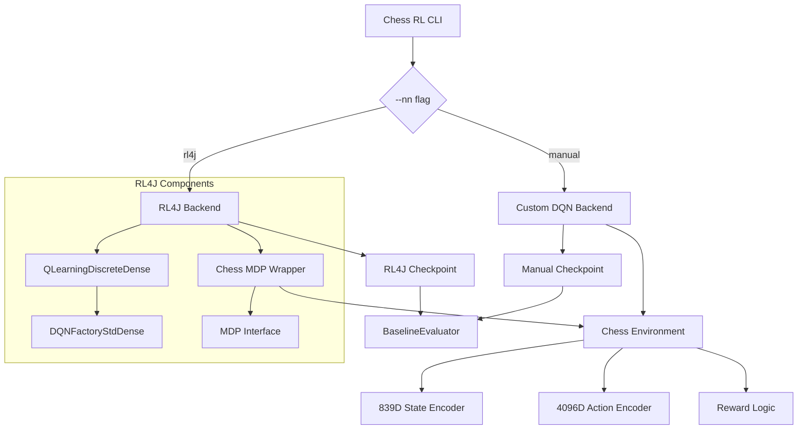
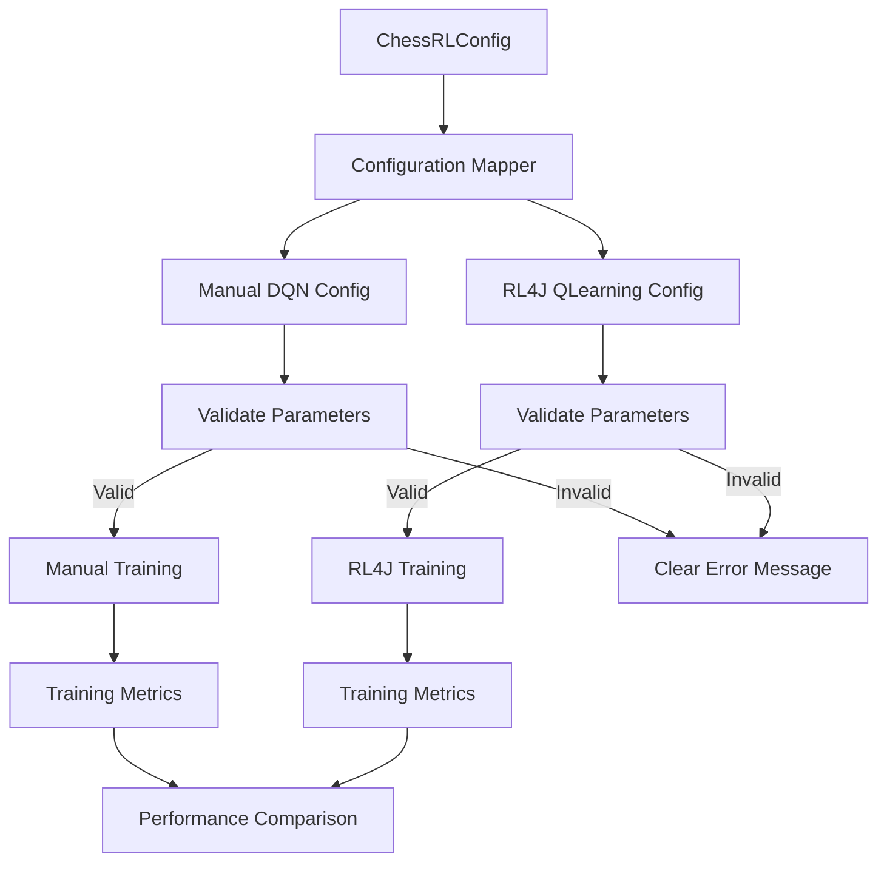

# Design Document

## Overview

This design implements an RL4J backend prototype that enables direct performance comparison with our existing custom DQN implementation. The architecture focuses on delivering functional parity while maintaining identical problem formulations (839-dimensional state encoding, 4096-dimensional action space) to ensure fair benchmarking.

The design extends the existing `--nn` CLI flag to support RL4J selection, wraps our chess environment in RL4J's MDP interface, and ensures both backends can be evaluated using the same infrastructure.

## Architecture

### High-Level Architecture



### Configuration Flow



## Components and Interfaces

### 1. CLI Extension

**Component**: `ChessRLCLI` enhancement
- **Purpose**: Extend `--nn` flag to support RL4J backend selection
- **Interface**: Modify existing neural network backend selection
- **Implementation**: 
```kotlin
enum class NeuralNetworkBackend {
    MANUAL, RL4J;
    
    companion object {
        fun fromString(value: String): NeuralNetworkBackend {
            return when (value.lowercase()) {
                "manual" -> MANUAL
                "rl4j" -> RL4J
                else -> throw IllegalArgumentException("Unknown NN backend: $value. Use 'manual' or 'rl4j'")
            }
        }
    }
}
```

### 2. Configuration Mapper

**Component**: `ConfigurationMapper`
- **Purpose**: Ensure identical hyperparameters across both backends
- **Interface**: Translates `ChessRLConfig` to backend-specific configurations
- **Implementation**:
```kotlin
class ConfigurationMapper {
    fun toManualConfig(config: ChessRLConfig): ManualDQNConfig {
        return ManualDQNConfig(
            learningRate = config.learningRate,
            batchSize = config.batchSize,
            gamma = config.gamma,
            targetUpdateFrequency = config.targetUpdateFrequency,
            maxExperienceBuffer = config.maxExperienceBuffer,
            hiddenLayers = config.hiddenLayers
        )
    }
    
    fun toRL4JConfig(config: ChessRLConfig): QLearning.QLConfiguration {
        validateParameters(config)
        return QLearning.QLConfiguration.builder()
            .seed(config.seed ?: Random.nextLong())
            .learningRate(config.learningRate)
            .gamma(config.gamma)
            .epsilonNbStep(1000)
            .minEpsilon(0.01)
            .expRepMaxSize(config.maxExperienceBuffer)
            .batchSize(config.batchSize)
            .targetDqnUpdateFreq(config.targetUpdateFrequency)
            .build()
    }
    
    private fun validateParameters(config: ChessRLConfig) {
        if (config.learningRate <= 0) {
            throw IllegalArgumentException("Learning rate must be positive, got: ${config.learningRate}")
        }
        // Additional validation...
    }
}
```

### 3. Chess MDP Wrapper

**Component**: `ChessMDP`
- **Purpose**: Adapt existing chess environment to RL4J's MDP interface
- **Interface**: Implements `MDP<ChessObservation, Integer, DiscreteSpace>`
- **Key Methods**:
```kotlin
class ChessMDP(private val chessEnvironment: ChessEnvironment) : MDP<ChessObservation, Integer, DiscreteSpace> {
    
    override fun reset(): ChessObservation {
        chessEnvironment.reset()
        return ChessObservation(chessEnvironment.getStateEncoding()) // 839 features
    }
    
    override fun step(action: Integer): StepReply<ChessObservation> {
        val legalActions = chessEnvironment.getLegalActions()
        
        val actualAction = if (action in legalActions) {
            action
        } else {
            logger.warn("Illegal action $action attempted, falling back to best legal move")
            legalActions.maxByOrNull { chessEnvironment.getActionValue(it) } ?: legalActions.first()
        }
        
        val stepResult = chessEnvironment.step(actualAction)
        return StepReply(
            ChessObservation(stepResult.nextState),
            stepResult.reward,
            stepResult.isDone,
            JSONObject() // info
        )
    }
    
    override fun isDone(): Boolean = chessEnvironment.isTerminal()
    
    override fun getObservationSpace(): ObservationSpace<ChessObservation> {
        return ArrayObservationSpace(intArrayOf(839))
    }
    
    override fun getActionSpace(): DiscreteSpace {
        return DiscreteSpace(4096)
    }
}
```

### 4. Backend Factory

**Component**: `BackendFactory`
- **Purpose**: Create appropriate backend based on CLI selection
- **Interface**: Factory pattern for backend instantiation
- **Implementation**:
```kotlin
class BackendFactory {
    fun createBackend(
        backendType: NeuralNetworkBackend,
        config: ChessRLConfig,
        chessEnvironment: ChessEnvironment
    ): TrainingBackend {
        return when (backendType) {
            NeuralNetworkBackend.MANUAL -> {
                val manualConfig = configMapper.toManualConfig(config)
                ManualDQNBackend(manualConfig, chessEnvironment)
            }
            NeuralNetworkBackend.RL4J -> {
                val rl4jConfig = configMapper.toRL4JConfig(config)
                val chessMDP = ChessMDP(chessEnvironment)
                RL4JBackend(rl4jConfig, chessMDP)
            }
        }
    }
}
```

### 5. Checkpoint Compatibility

**Component**: `UnifiedCheckpointManager`
- **Purpose**: Ensure both backends can be evaluated by BaselineEvaluator
- **Interface**: Common checkpoint format and loading mechanism
- **Implementation**:
```kotlin
class UnifiedCheckpointManager {
    fun saveCheckpoint(backend: TrainingBackend, path: String) {
        when (backend) {
            is ManualDQNBackend -> saveManualCheckpoint(backend, path)
            is RL4JBackend -> saveRL4JCheckpoint(backend, path)
        }
    }
    
    fun loadForEvaluation(checkpointPath: String): EvaluationModel {
        val metadata = loadMetadata(checkpointPath)
        return when (metadata.backendType) {
            "manual" -> loadManualModel(checkpointPath)
            "rl4j" -> loadRL4JModel(checkpointPath)
            else -> throw IllegalArgumentException("Unknown backend type: ${metadata.backendType}")
        }
    }
}
```

### 6. Metrics Collection

**Component**: `BenchmarkMetricsCollector`
- **Purpose**: Collect comparable performance data from both backends
- **Interface**: Standardized metrics collection across backends
- **Implementation**:
```kotlin
class BenchmarkMetricsCollector {
    fun collectTrainingMetrics(backend: TrainingBackend): TrainingMetrics {
        return TrainingMetrics(
            winRate = backend.getWinRate(),
            drawRate = backend.getDrawRate(),
            lossRate = backend.getLossRate(),
            averageLoss = backend.getAverageLoss(),
            illegalMoveCount = backend.getIllegalMoveCount(),
            trainingTimePerCycle = backend.getTrainingTimePerCycle(),
            peakMemoryUsage = getJVMPeakMemory()
        )
    }
    
    fun exportToCSV(metrics: List<TrainingMetrics>, filename: String) {
        // Export for analysis and plotting
    }
}
```

## Data Models

### Configuration Data

```kotlin
data class ChessRLConfig(
    val learningRate: Double,
    val batchSize: Int,
    val gamma: Double,
    val targetUpdateFrequency: Int,
    val maxExperienceBuffer: Int,
    val hiddenLayers: List<Int>,
    val seed: Long? = null
) {
    fun validate() {
        require(learningRate > 0) { "Learning rate must be positive: $learningRate" }
        require(batchSize > 0) { "Batch size must be positive: $batchSize" }
        require(gamma in 0.0..1.0) { "Gamma must be between 0 and 1: $gamma" }
        require(targetUpdateFrequency > 0) { "Target update frequency must be positive: $targetUpdateFrequency" }
        require(maxExperienceBuffer > batchSize) { "Experience buffer must be larger than batch size" }
    }
}
```

### Benchmark Data

```kotlin
data class TrainingMetrics(
    val cycle: Int,
    val winRate: Double,
    val drawRate: Double,
    val lossRate: Double,
    val averageLoss: Double,
    val illegalMoveCount: Int,
    val trainingTimePerCycle: Duration,
    val peakMemoryUsage: Long,
    val backend: String
)

data class BenchmarkResults(
    val manualMetrics: List<TrainingMetrics>,
    val rl4jMetrics: List<TrainingMetrics>,
    val configurationUsed: ChessRLConfig,
    val timestamp: Instant
)
```

### Chess MDP Data

```kotlin
class ChessObservation(private val stateVector: DoubleArray) : Observation {
    init {
        require(stateVector.size == 839) { "State vector must have 839 features, got: ${stateVector.size}" }
    }
    
    override fun getData(): INDArray = Nd4j.create(stateVector)
    override fun dup(): Observation = ChessObservation(stateVector.copyOf())
}
```

## Error Handling

### Configuration Validation

1. **Parameter Validation**: Validate all hyperparameters before training starts
2. **Clear Error Messages**: Provide actionable feedback for invalid configurations
3. **Consistent Validation**: Apply identical validation rules to both backends

### Runtime Error Handling

1. **Illegal Action Handling**: Log illegal actions and fall back to legal moves
2. **Training Failures**: Graceful handling of training interruptions with checkpoint recovery
3. **Memory Management**: Monitor and handle out-of-memory conditions

### Evaluation Compatibility

1. **Checkpoint Format Detection**: Automatically detect and handle different checkpoint formats
2. **Model Loading Errors**: Clear error messages when models can't be loaded for evaluation
3. **Evaluation Failures**: Robust error handling during baseline evaluation runs

## Testing Strategy

### Unit Tests

1. **Configuration Mapping Tests**:
   - Verify identical parameter mapping between backends
   - Test parameter validation with edge cases
   - Confirm error messages are clear and actionable

2. **Chess MDP Tests**:
   - Verify reset() returns standard starting position
   - Test step() with legal moves updates state correctly
   - Confirm illegal action fallback mechanism works
   - Validate observation and action space dimensions

3. **Checkpoint Compatibility Tests**:
   - Test saving and loading for both backend types
   - Verify BaselineEvaluator can load both checkpoint formats
   - Test metadata handling and format detection

### Integration Tests

1. **End-to-End Training Tests**:
   - Complete training cycle with both backends
   - Verify metrics collection works identically
   - Test CLI flag switching between backends

2. **Benchmark Pipeline Tests**:
   - Run controlled experiments with identical configurations
   - Verify metrics are collected and exported correctly
   - Test statistical analysis and reporting functions

### Acceptance Tests

1. **Functional Parity Test**: `./gradlew :integration:run --args="--train --nn rl4j ..."` completes successfully
2. **Configuration Consistency Test**: Both backends show identical hyperparameters at startup
3. **Evaluation Compatibility Test**: RL4J checkpoints load and play 20 evaluation games
4. **Benchmark Generation Test**: Side-by-side comparison plots are generated from collected data

## Implementation Phases

### Phase 1: Core RL4J Integration
- Add RL4J dependencies to build system
- Implement ChessMDP wrapper with unit tests
- Extend CLI to support `--nn rl4j` flag
- Basic end-to-end training pipeline

### Phase 2: Configuration Parity
- Implement ConfigurationMapper with validation
- Ensure identical hyperparameter handling
- Add configuration consistency verification
- Error handling for invalid parameters

### Phase 3: Checkpoint Compatibility
- Implement UnifiedCheckpointManager
- Ensure BaselineEvaluator works with both formats
- Add checkpoint format detection and metadata
- Test evaluation pipeline with both backend types

### Phase 4: Metrics Collection and Benchmarking
- Implement BenchmarkMetricsCollector
- Add controlled experiment framework
- Create data export and analysis tools
- Generate comparison reports and visualizations

### Phase 5: Extended Analysis (Optional)
- Resource scaling experiments
- Long-term performance analysis
- Hardware sensitivity studies
- Business case documentation

Each phase includes comprehensive testing and validation to ensure the RL4J backend provides true functional parity with the existing implementation.