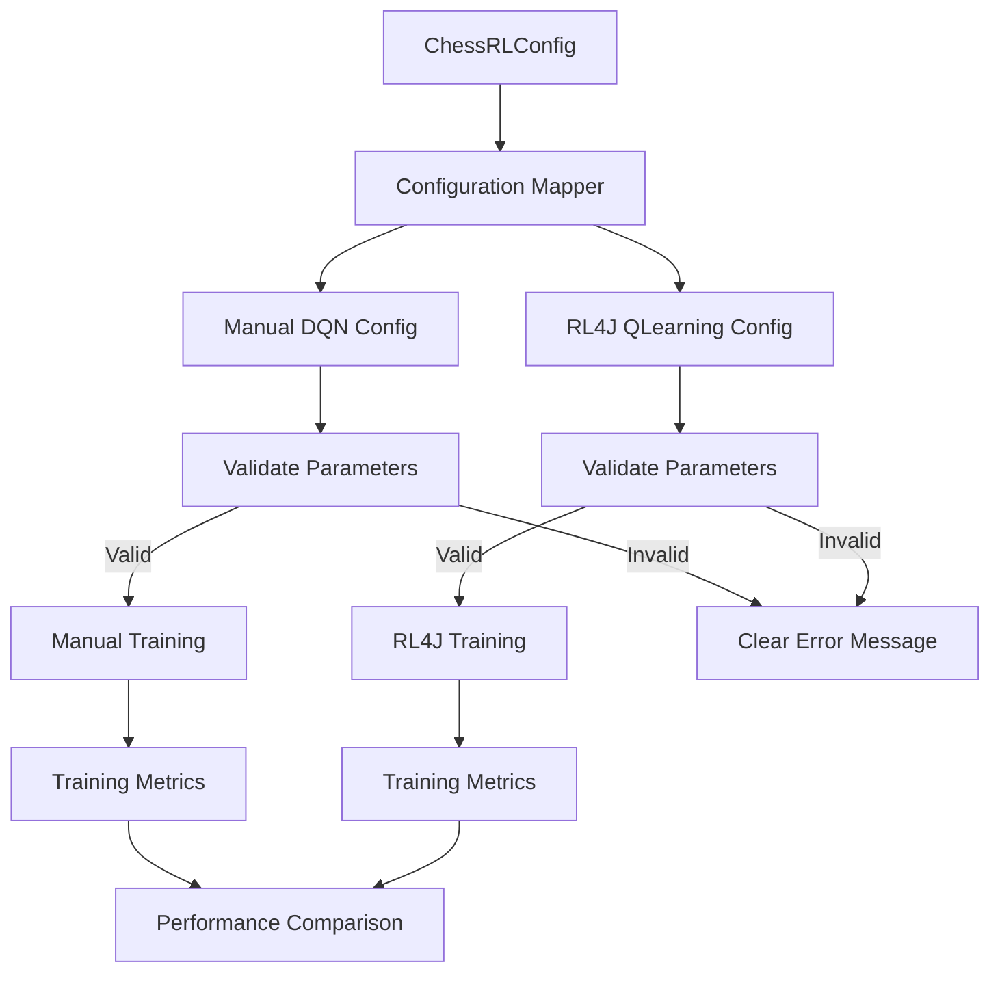

# Design Document

## Overview

This design implements real RL4J integration by replacing placeholder stubs with direct RL4J API calls, fixing the MDP bridge to use proper RL4J types, and ensuring the training loop drives actual RL4J trainers. The focus is on making RL4J work authentically rather than simulating it.

The key technical challenges addressed are:
1. Converting reflection-based stubs to direct RL4J method calls
2. Making Chess MDP components properly implement RL4J interfaces
3. Integrating real RL4J training loops instead of custom simulation
4. Enabling tests that run with actual RL4J runtime
5. Fixing CLI routing to use BackendFactory properly

## Architecture

### Current State vs Target State

```mermaid
graph TB
    subgraph "Current (Broken) State"
        CLI1[CLI] --> |hardcoded| DQN1[DqnLearningBackend]
        RL4JAgent1[RL4JChessAgent] --> |reflection stubs| TODO1[TODO methods]
        ChessMDP1[ChessMDP] --> |wrapper objects| RL4JWrapper1[toRL4JMDP()]
        RL4JBackend1[RL4JLearningBackend] --> |simulation| CustomLoop1[Custom training loop]
        Tests1[RL4J Tests] --> |short-circuit| Skip1[Skip if !available]
    end
    
    subgraph "Target (Working) State"
        CLI2[CLI] --> BackendFactory[BackendFactory]
        BackendFactory --> |--nn rl4j| RL4JBackend2[RL4JLearningBackend]
        RL4JAgent2[RL4JChessAgent] --> |direct calls| RL4JAPI[Real RL4J API]
        ChessMDP2[ChessMDP] --> |implements| RL4JInterfaces[MDP<Observation,Int,DiscreteSpace>]
        RL4JBackend2 --> |drives| RL4JTrainer[QLearningDiscreteDense]
        Tests2[RL4J Tests] --> |when available| RealRL4J[Test with real RL4J]
    end
```

### Configuration Flow



## Components and Interfaces

### 1. Real RL4J API Integration

**Component**: `RL4JChessAgent` refactoring
- **Purpose**: Replace reflection-based stubs with direct RL4J method calls
- **Current Problem**: Methods like `selectActionWithRealRL4J` contain TODO comments and fallback logic
- **Solution**: 
```kotlin
class RL4JChessAgent(private val dqn: QLearningDiscreteDense<ChessObservation>) : ChessAgent {
    
    override fun selectAction(observation: ChessObservation, legalActions: List<Int>): Int {
        // BEFORE: reflection-based stub with TODO
        // AFTER: direct RL4J call
        return dqn.policy.nextAction(observation)
    }
    
    override fun save(path: String) {
        // BEFORE: saveWithRealRL4J() with placeholder logic
        // AFTER: direct RL4J model saving
        dqn.save(path)
    }
    
    companion object {
        fun create(config: QLearning.QLConfiguration, mdp: ChessMDP): RL4JChessAgent {
            // BEFORE: createRealQLearningDiscreteDense() fallback
            // AFTER: direct RL4J instantiation
            val dqn = QLearningDiscreteDense(mdp, config)
            return RL4JChessAgent(dqn)
        }
    }
}
```

### 2. Proper MDP Bridge Implementation

**Component**: `ChessMDP` and related classes refactoring
- **Purpose**: Make Chess MDP components properly implement RL4J interfaces instead of using wrappers
- **Current Problem**: `ChessMDP.toRL4JMDP()` builds wrappers around wrong RL4J classes
- **Solution**:
```kotlin
// BEFORE: Wrapper approach
class ChessMDP {
    fun toRL4JMDP(): SomeWrapperClass { /* wrong approach */ }
}

// AFTER: Direct implementation
class ChessMDP(private val env: ChessEnvironment) : MDP<ChessObservation, Int, DiscreteSpace> {
    
    override fun reset(): ChessObservation {
        env.reset()
        return ChessObservation(env.getStateEncoding())
    }
    
    override fun step(action: Int): StepReply<ChessObservation> {
        val result = env.step(action)
        return StepReply(
            ChessObservation(result.nextState),
            result.reward,
            result.isDone,
            JSONObject()
        )
    }
    
    override fun getObservationSpace(): ObservationSpace<ChessObservation> = ChessObservationSpace()
    override fun getActionSpace(): DiscreteSpace = ChessActionSpace()
    override fun isDone(): Boolean = env.isTerminal()
    override fun close() {}
    override fun newInstance(): MDP<ChessObservation, Int, DiscreteSpace> = ChessMDP(env.clone())
}

class ChessObservationSpace : ObservationSpace<ChessObservation> {
    override fun getName(): String = "ChessObservation"
    override fun getShape(): IntArray = intArrayOf(839)
    override fun getSampleObservation(): ChessObservation = ChessObservation(DoubleArray(839))
}

class ChessActionSpace : DiscreteSpace(4096) {
    // Inherits all DiscreteSpace functionality
}
```

### 3. Real RL4J Training Loop Integration

**Component**: `RL4JLearningBackend` refactoring
- **Purpose**: Drive actual RL4J training loops instead of simulating them
- **Current Problem**: `trainBatch()` executes custom environment stepping and pretends to compute loss
- **Solution**:
```kotlin
class RL4JLearningBackend(
    private val config: QLearning.QLConfiguration,
    private val mdp: ChessMDP
) : LearningBackend {
    
    private val dqn: QLearningDiscreteDense<ChessObservation> = QLearningDiscreteDense(mdp, config)
    
    override fun trainBatch(): TrainingResult {
        // BEFORE: Custom environment stepping simulation
        // val stepResult = environment.step(action)
        // val fakeLoss = computeFakeLoss(stepResult)
        
        // AFTER: Real RL4J training
        val trainingResult = dqn.train()  // Uses RL4J's built-in training loop
        
        return TrainingResult(
            loss = trainingResult.loss,
            episodeReward = trainingResult.episodeReward,
            stepsThisEpisode = trainingResult.stepsThisEpisode
        )
    }
    
    override fun save(path: String) {
        // BEFORE: Placeholder save logic
        // AFTER: Real RL4J model persistence
        dqn.save(path)
    }
    
    override fun load(path: String) {
        // BEFORE: Placeholder load logic  
        // AFTER: Real RL4J model loading
        dqn.load(path)
    }
}
```

### 4. CLI Backend Factory Integration

**Component**: `ChessRLCLI.handleTrain()` refactoring
- **Purpose**: Route CLI requests through BackendFactory instead of hardcoding DqnLearningBackend
- **Current Problem**: CLI instantiates DqnLearningBackend directly, bypassing BackendFactory
- **Solution**:
```kotlin
// BEFORE: Hardcoded backend instantiation
fun handleTrain(args: TrainArgs) {
    val backend = DqnLearningBackend(config, environment) // Always manual backend
    backend.train()
}

// AFTER: Proper factory routing
fun handleTrain(args: TrainArgs) {
    val selectedBackend = NeuralNetworkBackend.fromString(args.neuralNetwork)
    val backend = BackendFactory.createBackend(selectedBackend, config, environment)
    backend.train()
}

// Ensure BackendFactory respects the backend parameter
class BackendFactory {
    fun createBackend(
        backendType: NeuralNetworkBackend,
        config: ChessRLConfig,
        environment: ChessEnvironment
    ): LearningBackend {
        return when (backendType) {
            NeuralNetworkBackend.MANUAL -> ManualDQNBackend(config, environment)
            NeuralNetworkBackend.RL4J -> {
                if (!RL4JAvailability.isAvailable()) {
                    throw IllegalStateException("RL4J backend requested but RL4J not available")
                }
                RL4JLearningBackend(config, ChessMDP(environment))
            }
        }
    }
}
```

### 5. RL4J Runtime Testing

**Component**: Integration test infrastructure
- **Purpose**: Enable tests that run with actual RL4J on the classpath
- **Current Problem**: All RL4J tests short-circuit if `RL4JAvailability.isAvailable()` is false
- **Solution**:
```kotlin
// BEFORE: Tests always skip when RL4J not available
@Test
fun testRL4JIntegration() {
    if (!RL4JAvailability.isAvailable()) {
        return // Skip test
    }
    // Test never actually runs in practice
}

// AFTER: Conditional test execution with real RL4J
@Test
@EnabledIf("com.chessrl.integration.backend.RL4JAvailability#isAvailable")
fun testRL4JIntegration() {
    // This test only runs when RL4J is actually available
    val mdp = ChessMDP(chessEnvironment)
    val config = QLearning.QLConfiguration.builder().build()
    val dqn = QLearningDiscreteDense(mdp, config)
    
    // Test real RL4J training
    val result = dqn.train()
    assertThat(result).isNotNull()
    
    // Test real RL4J saving/loading
    dqn.save("test_model.zip")
    val loaded = QLearningDiscreteDense.load("test_model.zip")
    assertThat(loaded).isNotNull()
}

// Gradle configuration to enable RL4J in CI
// gradle.properties or CI environment:
// enableRL4J=true
```

### 6. Metrics Collection

**Component**: `BenchmarkMetricsCollector`
- **Purpose**: Collect comparable performance data from both backends
- **Interface**: Standardized metrics collection across backends
- **Implementation**:
```kotlin
class BenchmarkMetricsCollector {
    fun collectTrainingMetrics(backend: TrainingBackend): TrainingMetrics {
        return TrainingMetrics(
            winRate = backend.getWinRate(),
            drawRate = backend.getDrawRate(),
            lossRate = backend.getLossRate(),
            averageLoss = backend.getAverageLoss(),
            illegalMoveCount = backend.getIllegalMoveCount(),
            trainingTimePerCycle = backend.getTrainingTimePerCycle(),
            peakMemoryUsage = getJVMPeakMemory()
        )
    }
    
    fun exportToCSV(metrics: List<TrainingMetrics>, filename: String) {
        // Export for analysis and plotting
    }
}
```

## Data Models

### Configuration Data

```kotlin
data class ChessRLConfig(
    val learningRate: Double,
    val batchSize: Int,
    val gamma: Double,
    val targetUpdateFrequency: Int,
    val maxExperienceBuffer: Int,
    val hiddenLayers: List<Int>,
    val seed: Long? = null
) {
    fun validate() {
        require(learningRate > 0) { "Learning rate must be positive: $learningRate" }
        require(batchSize > 0) { "Batch size must be positive: $batchSize" }
        require(gamma in 0.0..1.0) { "Gamma must be between 0 and 1: $gamma" }
        require(targetUpdateFrequency > 0) { "Target update frequency must be positive: $targetUpdateFrequency" }
        require(maxExperienceBuffer > batchSize) { "Experience buffer must be larger than batch size" }
    }
}
```

### Benchmark Data

```kotlin
data class TrainingMetrics(
    val cycle: Int,
    val winRate: Double,
    val drawRate: Double,
    val lossRate: Double,
    val averageLoss: Double,
    val illegalMoveCount: Int,
    val trainingTimePerCycle: Duration,
    val peakMemoryUsage: Long,
    val backend: String
)

data class BenchmarkResults(
    val manualMetrics: List<TrainingMetrics>,
    val rl4jMetrics: List<TrainingMetrics>,
    val configurationUsed: ChessRLConfig,
    val timestamp: Instant
)
```

### Chess MDP Data

```kotlin
class ChessObservation(private val stateVector: DoubleArray) : Observation {
    init {
        require(stateVector.size == 839) { "State vector must have 839 features, got: ${stateVector.size}" }
    }
    
    override fun getData(): INDArray = Nd4j.create(stateVector)
    override fun dup(): Observation = ChessObservation(stateVector.copyOf())
}
```

## Error Handling

### Configuration Validation

1. **Parameter Validation**: Validate all hyperparameters before training starts
2. **Clear Error Messages**: Provide actionable feedback for invalid configurations
3. **Consistent Validation**: Apply identical validation rules to both backends

### Runtime Error Handling

1. **Illegal Action Handling**: Log illegal actions and fall back to legal moves
2. **Training Failures**: Graceful handling of training interruptions with checkpoint recovery
3. **Memory Management**: Monitor and handle out-of-memory conditions

### Evaluation Compatibility

1. **Checkpoint Format Detection**: Automatically detect and handle different checkpoint formats
2. **Model Loading Errors**: Clear error messages when models can't be loaded for evaluation
3. **Evaluation Failures**: Robust error handling during baseline evaluation runs

## Testing Strategy

### Unit Tests

1. **Configuration Mapping Tests**:
   - Verify identical parameter mapping between backends
   - Test parameter validation with edge cases
   - Confirm error messages are clear and actionable

2. **Chess MDP Tests**:
   - Verify reset() returns standard starting position
   - Test step() with legal moves updates state correctly
   - Confirm illegal action fallback mechanism works
   - Validate observation and action space dimensions

3. **Checkpoint Compatibility Tests**:
   - Test saving and loading for both backend types
   - Verify BaselineEvaluator can load both checkpoint formats
   - Test metadata handling and format detection

### Integration Tests

1. **End-to-End Training Tests**:
   - Complete training cycle with both backends
   - Verify metrics collection works identically
   - Test CLI flag switching between backends

2. **Benchmark Pipeline Tests**:
   - Run controlled experiments with identical configurations
   - Verify metrics are collected and exported correctly
   - Test statistical analysis and reporting functions

### Acceptance Tests

1. **Functional Parity Test**: `./gradlew :integration:run --args="--train --nn rl4j ..."` completes successfully
2. **Configuration Consistency Test**: Both backends show identical hyperparameters at startup
3. **Evaluation Compatibility Test**: RL4J checkpoints load and play 20 evaluation games
4. **Benchmark Generation Test**: Side-by-side comparison plots are generated from collected data

## Implementation Phases

### Phase 1: Core RL4J Integration
- Add RL4J dependencies to build system
- Implement ChessMDP wrapper with unit tests
- Extend CLI to support `--nn rl4j` flag
- Basic end-to-end training pipeline

### Phase 2: Configuration Parity
- Implement ConfigurationMapper with validation
- Ensure identical hyperparameter handling
- Add configuration consistency verification
- Error handling for invalid parameters

### Phase 3: Checkpoint Compatibility
- Implement UnifiedCheckpointManager
- Ensure BaselineEvaluator works with both formats
- Add checkpoint format detection and metadata
- Test evaluation pipeline with both backend types

### Phase 4: Metrics Collection and Benchmarking
- Implement BenchmarkMetricsCollector
- Add controlled experiment framework
- Create data export and analysis tools
- Generate comparison reports and visualizations

### Phase 5: Extended Analysis (Optional)
- Resource scaling experiments
- Long-term performance analysis
- Hardware sensitivity studies
- Business case documentation

Each phase includes comprehensive testing and validation to ensure the RL4J backend provides true functional parity with the existing implementation.