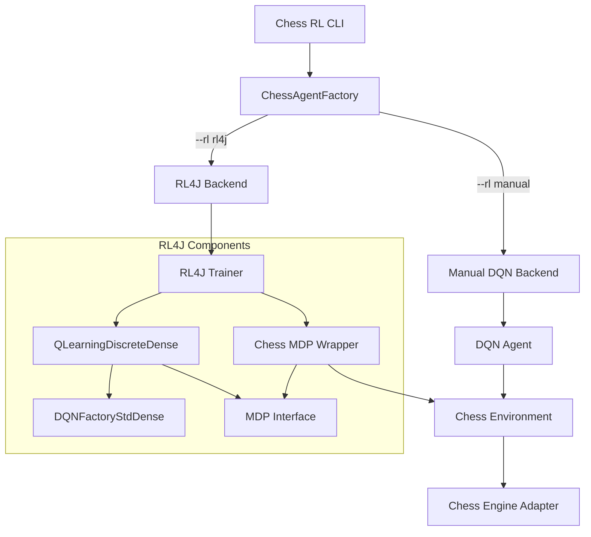
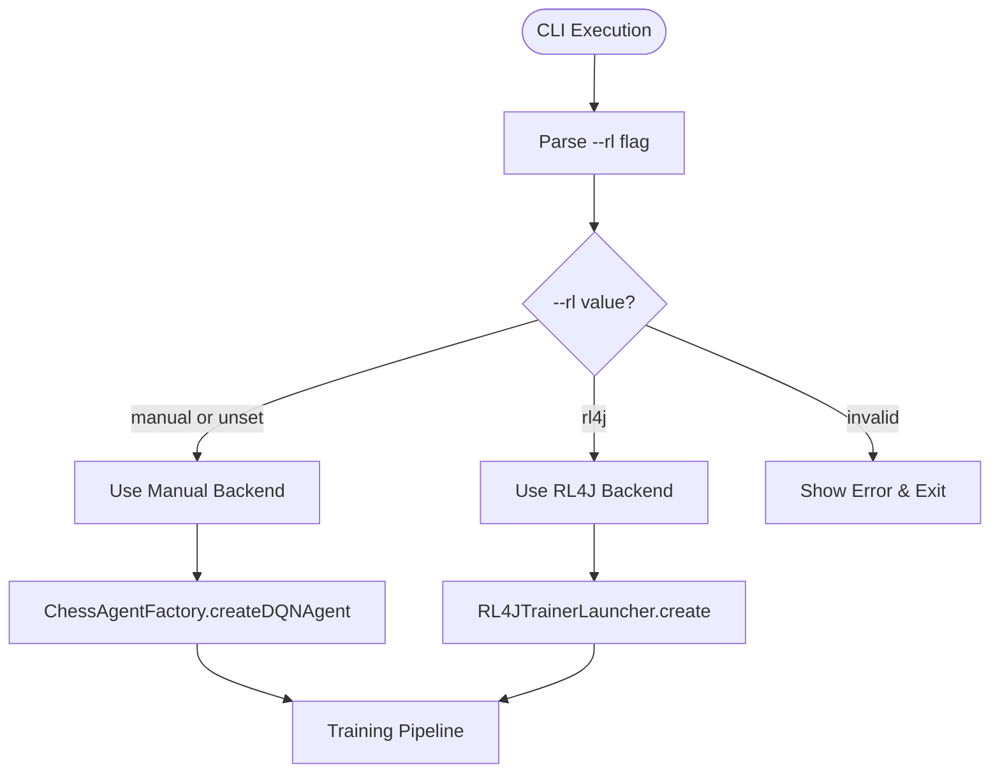

# Design Document

## Overview

This design implements RL4J (Reinforcement Learning for Java) as an alternative backend to the existing manual DQN implementation. The integration follows a pluggable architecture pattern where users can select between backends via a `--rl` CLI flag while maintaining full compatibility with existing chess engine integration, state encoding, and neural network components.

The design preserves the current 839-dimensional state encoding and 4096-dimensional action space, wrapping them in RL4J-compatible interfaces. It implements strict legal move enforcement through action masking and provides seamless checkpoint compatibility between backends.

## Architecture

### High-Level Architecture



### Backend Selection Flow



### Component Integration

The design maintains the existing `LearningBackend` interface pattern, adding RL4J as a new backend implementation:

```kotlin
interface LearningBackend {
    val id: String
    fun createSession(config: ChessRLConfig): LearningSession
}

class Rl4jLearningBackend : LearningBackend {
    override val id: String = "rl4j"
    override fun createSession(config: ChessRLConfig): LearningSession
}
```

## Components and Interfaces

### 1. CLI Integration

**Component**: `ChessRLCLI` enhancement
- **Purpose**: Add `--rl` flag support with validation
- **Interface**: Extends existing CLI argument parsing
- **Implementation**: 
  - Add `--rl manual|rl4j` flag parsing
  - Default to `manual` for backward compatibility
  - Pass backend selection to `ChessAgentFactory`

### 2. Backend Factory Enhancement

**Component**: `ChessAgentFactory` routing
- **Purpose**: Route agent creation based on backend selection
- **Interface**: Extends existing factory methods
- **Implementation**:
```kotlin
fun createDQNAgent(
    // existing parameters...
    rlBackend: String = "manual"
): ChessAgent {
    return when (rlBackend.lowercase()) {
        "manual" -> createManualDQNAgent(...)
        "rl4j" -> createRL4JAgent(...)
        else -> throw IllegalArgumentException("Unknown RL backend: $rlBackend")
    }
}
```

### 3. RL4J MDP Wrapper

**Component**: `ChessMDP`
- **Purpose**: Adapt chess environment to RL4J's MDP interface
- **Interface**: Implements `MDP<ChessObservation, Int, DiscreteSpace>`
- **Key Methods**:
  - `reset()`: Initialize chess position, return encoded observation
  - `step(action)`: Apply move, compute reward, check terminal state
  - `isDone()`: Terminal state detection via existing game outcome logic
  - `getObservationSpace()`: Return 839-dimensional observation space
  - `getActionSpace()`: Return 4096-dimensional discrete action space

### 4. Observation and Action Spaces

**Component**: RL4J-compatible wrappers
- **ChessObservation**: Wraps `DoubleArray[839]` in RL4J observation format
- **ChessActionSpace**: `DiscreteSpace(4096)` for chess moves
- **ChessObservationSpace**: `ArrayObservationSpace<double[839]>` for state encoding

### 5. RL4J Configuration Mapper

**Component**: `RL4JConfigMapper`
- **Purpose**: Translate `ChessRLConfig` to RL4J configuration objects
- **Mappings**:
  - `learningRate` → `QLearningConfiguration.learningRate`
  - `batchSize` → `QLearningConfiguration.batchSize`
  - `maxExperienceBuffer` → `QLearningConfiguration.expRepMaxSize`
  - `targetUpdateFrequency` → `QLearningConfiguration.targetDqnUpdateFreq`
  - `gamma` → `QLearningConfiguration.gamma`
  - `explorationRate` → Epsilon schedule configuration

### 6. Action Masking System

**Component**: Two-phase masking implementation
- **Phase 1 (Fallback)**: In `ChessMDP.step()`, if selected action is illegal, choose legal fallback
- **Phase 2 (Masking)**: Custom policy wrapper that masks illegal actions before selection
- **Implementation**: 
  - Query valid actions from chess environment
  - Set Q-values of illegal actions to large negative values
  - Ensure policy only selects from legal action set

### 7. Checkpoint Compatibility

**Component**: `RL4JCheckpointManager`
- **Purpose**: Handle RL4J model persistence with existing checkpoint system
- **Features**:
  - Save RL4J models as `.zip` files alongside metadata
  - Support loading both `.json` (manual) and `.zip` (RL4J) formats
  - Maintain best model selection logic across backends
  - Generate compatible metadata for evaluation system

## Data Models

### Configuration Mapping

```kotlin
data class RL4JConfig(
    val qLearningConfig: QLearning.QLConfiguration,
    val dqnFactoryConfig: DQNFactoryStdDense.Configuration,
    val maskingEnabled: Boolean = true,
    val fallbackEnabled: Boolean = false
)

fun ChessRLConfig.toRL4JConfig(): RL4JConfig {
    val qConfig = QLearning.QLConfiguration.builder()
        .seed(seed ?: Random.nextLong())
        .learningRate(learningRate)
        .gamma(gamma)
        .epsilonNbStep(1000) // Decay over 1000 steps
        .minEpsilon(0.01)
        .expRepMaxSize(maxExperienceBuffer)
        .batchSize(batchSize)
        .targetDqnUpdateFreq(targetUpdateFrequency)
        .maxStep(maxStepsPerGame)
        .build()
    
    val dqnConfig = DQNFactoryStdDense.Configuration.builder()
        .learningRate(learningRate)
        .l2(0.001) // L2 regularization
        .activation(Activation.RELU)
        .build()
    
    return RL4JConfig(qConfig, dqnConfig)
}
```

### MDP State Representation

```kotlin
class ChessObservation(val stateVector: DoubleArray) : Observation {
    override fun getData(): INDArray = Nd4j.create(stateVector)
    override fun dup(): Observation = ChessObservation(stateVector.copyOf())
}

class ChessActionSpace : DiscreteSpace(4096) {
    fun isValidAction(action: Int, validActions: List<Int>): Boolean {
        return action in validActions
    }
}
```

## Error Handling

### Illegal Action Handling

1. **Detection**: Monitor action selection in `ChessMDP.step()`
2. **Fallback Strategy**: 
   - Log illegal action attempt
   - Select highest Q-value legal action as fallback
   - Continue training without interruption
3. **Masking Strategy**:
   - Pre-process Q-values before action selection
   - Set illegal actions to `-Double.MAX_VALUE`
   - Ensure argmax only selects legal actions

### Configuration Validation

1. **RL4J Dependency Check**: Verify RL4J classes are available at runtime
2. **Parameter Validation**: Ensure all mapped parameters are within RL4J acceptable ranges
3. **Graceful Degradation**: Fall back to manual backend if RL4J initialization fails

### Model Loading Errors

1. **Format Detection**: Automatically detect `.json` vs `.zip` model formats
2. **Cross-Backend Loading**: Prevent loading RL4J models with manual backend and vice versa
3. **Metadata Validation**: Verify model compatibility with current configuration

## Testing Strategy

### Unit Tests

1. **MDP Wrapper Tests**:
   - `ChessMDP.reset()` returns valid initial observation
   - `ChessMDP.step()` handles legal and illegal actions correctly
   - `ChessMDP.isDone()` detects terminal states accurately
   - Observation and action space dimensions are correct

2. **Configuration Mapping Tests**:
   - `ChessRLConfig` → RL4J configuration translation accuracy
   - Parameter validation and error handling
   - Edge cases (null values, out-of-range parameters)

3. **Action Masking Tests**:
   - Illegal actions are properly masked or handled via fallback
   - Legal action selection maintains policy correctness
   - Performance impact of masking is acceptable

### Integration Tests

1. **End-to-End Training**:
   - RL4J backend completes training cycles without errors
   - Metrics collection works identically to manual backend
   - Checkpoint saving and loading functions correctly

2. **Backend Switching**:
   - CLI flag properly routes to correct backend
   - Configuration compatibility between backends
   - Error messages are clear and actionable

3. **Evaluation Compatibility**:
   - RL4J-trained models work with existing evaluation system
   - Head-to-head matches between manual and RL4J models
   - JSON output format consistency

### Performance Tests

1. **Training Speed Comparison**:
   - Measure training throughput (games/second) for both backends
   - Memory usage comparison during training
   - Convergence rate analysis

2. **Action Selection Performance**:
   - Latency of masked vs unmasked action selection
   - Impact of action masking on training speed
   - Scalability with different action space sizes

### Soak Tests

1. **Long-Running Training**:
   - Multi-hour training runs with RL4J backend
   - Checkpoint integrity over extended periods
   - Memory leak detection and resource cleanup

2. **Stability Testing**:
   - Repeated training runs with identical seeds
   - Deterministic behavior verification
   - Error recovery and graceful degradation

## Implementation Phases

### Phase 1: Foundation (Milestones 1-2)
- Add `--rl` CLI flag and routing logic
- Add RL4J dependencies to build system
- Create placeholder observation and action space classes
- Implement basic backend selection in `ChessAgentFactory`

### Phase 2: Core MDP Integration (Milestone 3)
- Implement `ChessMDP` wrapper with full interface compliance
- Integrate with existing chess engine adapters
- Implement reward computation and terminal state detection
- Add comprehensive unit tests for MDP functionality

### Phase 3: RL4J Training Pipeline (Milestone 4)
- Implement RL4J configuration mapping
- Create QL-Learning trainer with DQN factory
- Integrate with existing training pipeline
- Add basic checkpoint saving functionality

### Phase 4: Action Masking (Milestone 5)
- Implement Phase 1 fallback masking in MDP
- Develop Phase 2 policy-level masking
- Add masking performance optimization
- Comprehensive testing of legal move enforcement

### Phase 5: Checkpoint System (Milestone 6)
- Implement RL4J-compatible checkpoint manager
- Add support for `.zip` model format
- Maintain backward compatibility with `.json` format
- Integrate with existing best model selection logic

### Phase 6: CLI and Profile Integration (Milestone 7)
- Complete CLI flag integration
- Map profile parameters to RL4J configuration
- Ensure configuration parity between backends
- Add comprehensive CLI help documentation

### Phase 7: Testing and Validation (Milestone 8)
- Complete unit test suite
- Integration testing with existing evaluation system
- Performance benchmarking and optimization
- Soak testing for stability and reliability

Each phase includes acceptance criteria validation and user feedback incorporation before proceeding to the next phase.