# System Architecture Documentation

## Overview

The Chess RL Bot is a production-ready reinforcement learning system built with Kotlin Multiplatform, designed to train chess-playing agents through self-play. The system prioritizes JVM performance for training while maintaining native compilation capability for deployment.

## Architecture Principles

### Core Design Philosophy
- **Modular Architecture**: Four independent packages with well-defined interfaces
- **Performance First**: JVM-optimized training with 5-8x performance advantage
- **Production Ready**: Comprehensive error handling, monitoring, and recovery
- **Testability**: 166+ tests covering unit, integration, and performance scenarios
- **Scalability**: Efficient batch processing and memory management

### Implementation Experience Insights
Based on Tasks 1-8 implementation, key architectural decisions include:

- **JVM Training Target**: Benchmarking confirmed significant performance advantages
- **Enhanced Episode Tracking**: Detailed termination analysis (game ended, step limit, manual)
- **Flexible RL Framework**: Support for both DQN and Policy Gradient algorithms
- **Comprehensive Validation**: Training validation framework with issue detection

## System Components

### 1. Neural Network Package (`nn-package`)

**Purpose**: Comprehensive neural network library with advanced training features

**Key Components**:
```kotlin
// Core neural network with complete training infrastructure
interface NeuralNetwork {
    fun forward(input: DoubleArray): DoubleArray
    fun backward(target: DoubleArray): DoubleArray
    fun train(dataset: Dataset, epochs: Int, batchSize: Int): TrainingHistory
    fun setOptimizer(optimizer: Optimizer)
    fun setLossFunction(lossFunction: LossFunction)
}

// Advanced optimizers
class AdamOptimizer(beta1: Double = 0.9, beta2: Double = 0.999)
class RMSpropOptimizer(decay: Double = 0.9)
class SGDOptimizer(momentum: Double = 0.0)

// Loss functions
class MSELoss : LossFunction
class CrossEntropyLoss : LossFunction
class HuberLoss : LossFunction  // For RL stability
```

**Features**:
- Multiple optimizers (Adam, RMSprop, SGD with momentum)
- Various loss functions (MSE, CrossEntropy, Huber)
- Regularization techniques (L1/L2, Dropout)
- Efficient batch processing (32-128 batch sizes)
- Model serialization and checkpointing

### 2. Chess Engine (`chess-engine`)

**Purpose**: Complete chess game implementation with full rule support

**Key Components**:
```kotlin
// Complete chess board with all rules
data class ChessBoard(
    private val pieces: Array<Array<Piece?>>,
    private val gameState: GameState
) {
    fun makeMove(move: Move): MoveResult
    fun getAllValidMoves(color: PieceColor): List<Move>
    fun isCheckmate(color: PieceColor): Boolean
    fun isStalemate(color: PieceColor): Boolean
}

// Game state detection
class GameStateDetection {
    fun detectCheckmate(board: ChessBoard, color: PieceColor): Boolean
    fun detectStalemate(board: ChessBoard, color: PieceColor): Boolean
    fun detectDraw(board: ChessBoard): DrawType?
}

// PGN support for chess databases
interface PGNParser {
    fun parseGame(pgn: String): List<Move>
    fun parseDatabase(pgnFile: String): List<List<Move>>
}
```

**Features**:
- Complete chess rule implementation
- Special moves (castling, en passant, promotion)
- Game state detection (checkmate, stalemate, draws)
- PGN parsing and FEN support
- Board visualization and analysis tools

### 3. RL Framework (`rl-framework`)

**Purpose**: Flexible reinforcement learning framework supporting multiple algorithms

**Key Components**:
```kotlin
// Generic RL interfaces
interface Environment<S, A> {
    fun reset(): S
    fun step(action: A): StepResult<S>
    fun getValidActions(state: S): List<A>
}

interface Agent<S, A> {
    fun selectAction(state: S, validActions: List<A>): A
    fun learn(experience: Experience<S, A>)
}

// Advanced RL algorithms
class DQNAlgorithm(
    private val qNetwork: NeuralNetwork,
    private val targetNetwork: NeuralNetwork,
    private val experienceReplay: ExperienceReplay
) : RLAlgorithm

class PolicyGradientAlgorithm(
    private val policyNetwork: NeuralNetwork,
    private val valueNetwork: NeuralNetwork?
) : RLAlgorithm
```

**Features**:
- DQN with target networks and experience replay
- Policy Gradient (REINFORCE) with optional baseline
- Multiple exploration strategies (epsilon-greedy, UCB)
- Experience replay with prioritization
- Training validation and issue detection

### 4. Integration Layer (`integration`)

**Purpose**: Chess-specific RL integration with production training pipeline

**Key Components**:
```kotlin
// Chess environment for RL
class ChessEnvironment : Environment<DoubleArray, Int> {
    private val stateEncoder: ChessStateEncoder  // 776-feature encoding
    private val actionDecoder: ChessActionDecoder  // 4096 action space
    
    override fun step(action: Int): StepResult<DoubleArray>
}

// Chess RL agent
class ChessAgent : Agent<DoubleArray, Int> {
    private val neuralNetwork: NeuralNetwork
    private val rlAlgorithm: RLAlgorithm
    
    override fun selectAction(state: DoubleArray, validActions: List<Int>): Int
}

// Advanced training pipeline
class ChessTrainingPipeline {
    fun trainAgent(episodes: Int, config: TrainingConfig): TrainingResult
    fun validateTraining(agent: ChessAgent): ValidationResult
}
```

**Features**:
- 776-feature chess state encoding
- 4096 action space with move mapping
- Advanced training pipeline with validation
- Self-play system with concurrent games
- Comprehensive monitoring and debugging tools

## Data Flow Architecture

```mermaid
graph TB
    subgraph "Training Pipeline"
        A[Chess Environment] --> B[State Encoder]
        B --> C[Neural Network]
        C --> D[Action Decoder]
        D --> E[Chess Agent]
        E --> F[Experience Collection]
        F --> G[Batch Training]
        G --> C
    end
    
    subgraph "Self-Play System"
        H[Self-Play Controller] --> I[Concurrent Games]
        I --> J[Experience Buffer]
        J --> K[Training Validation]
        K --> L[Model Updates]
    end
    
    subgraph "Monitoring & Analysis"
        M[Performance Monitor] --> N[Training Metrics]
        N --> O[Convergence Detection]
        O --> P[Issue Detection]
        P --> Q[Recovery Actions]
    end
```



## State and Action Encoding

### Chess State Representation (776 features)
```kotlin
class ChessStateEncoder {
    // Board representation: 8x8x12 = 768 features
    // - 6 piece types × 2 colors × 64 squares
    private fun encodePiecePlanes(board: ChessBoard): DoubleArray
    
    // Game state features: 8 features
    // - Castling rights (4), en passant (1), move counts (3)
    private fun encodeGameState(board: ChessBoard): DoubleArray
    
    fun encode(board: ChessBoard): DoubleArray {
        val piecePlanes = encodePiecePlanes(board)  // 768 features
        val gameState = encodeGameState(board)      // 8 features
        return piecePlanes + gameState              // 776 total
    }
}
```

### Chess Action Representation (4096 actions)
```kotlin
class ChessActionDecoder {
    // Move encoding: from_square (64) × to_square (64) = 4096
    // Additional encoding for pawn promotion
    
    fun decode(actionIndex: Int, validMoves: List<Move>): Move {
        val fromSquare = actionIndex / 64
        val toSquare = actionIndex % 64
        return findMatchingMove(fromSquare, toSquare, validMoves)
    }
    
    fun encode(move: Move): Int {
        return move.from.toIndex() * 64 + move.to.toIndex()
    }
}
```

## Performance Characteristics

### JVM vs Native Performance
Based on comprehensive benchmarking:

| Operation | JVM Performance | Native Performance | Advantage |
|-----------|----------------|-------------------|-----------|
| Neural Network Training | 100% | 12-20% | 5-8x faster |
| Chess Move Generation | 100% | 85-90% | 1.1-1.2x faster |
| Experience Processing | 100% | 70-80% | 1.2-1.4x faster |
| Overall Training | 100% | 15-25% | 4-6x faster |

### Memory Management
- **Training Memory**: 100-500MB typical usage
- **Experience Buffer**: Circular buffer for 50K+ experiences
- **Batch Processing**: Optimized for 32-128 batch sizes
- **Garbage Collection**: Minimal allocations during training

### Scalability Characteristics
- **Concurrent Games**: 1-8 parallel self-play games
- **Training Throughput**: 5-7 episodes per second
- **Experience Collection**: 1000+ experiences per minute
- **Model Updates**: Sub-second batch processing

## Error Handling Strategy

### Error Categories
1. **Chess Engine Errors**: Invalid moves, illegal positions
2. **Neural Network Errors**: Numerical instability, dimension mismatches
3. **RL Training Errors**: Convergence issues, experience buffer problems
4. **Integration Errors**: State/action encoding issues

### Recovery Mechanisms
```kotlin
sealed class ChessRLError : Exception() {
    data class InvalidMove(val move: Move, val reason: String) : ChessRLError()
    data class NetworkError(val operation: String, val cause: Throwable) : ChessRLError()
    data class TrainingError(val episode: Int, val cause: Throwable) : ChessRLError()
}

interface ErrorHandler {
    fun handleError(error: ChessRLError): RecoveryAction
}

enum class RecoveryAction { RETRY, SKIP, ABORT, FALLBACK }
```

## Testing Architecture

### Test Coverage (166+ tests)
- **Unit Tests**: Individual component validation
- **Integration Tests**: Cross-component interaction
- **Performance Tests**: Benchmarking and optimization
- **End-to-End Tests**: Complete training pipeline validation

### Test Categories
1. **Chess Engine**: Move validation, game rules, PGN parsing
2. **Neural Network**: Forward/backward pass, training convergence
3. **RL Framework**: Algorithm correctness, exploration strategies
4. **Integration**: State encoding, action decoding, training pipeline

## Configuration Management

### Training Configuration
```kotlin
data class TrainingConfig(
    val episodes: Int = 1000,
    val maxStepsPerEpisode: Int = 200,
    val batchSize: Int = 64,
    val learningRate: Double = 0.001,
    val explorationRate: Double = 0.1,
    val explorationDecay: Double = 0.995,
    val targetUpdateFrequency: Int = 100,
    val experienceBufferSize: Int = 50000,
    val validationFrequency: Int = 100
)
```

### Network Architecture Configuration
```kotlin
data class NetworkConfig(
    val inputSize: Int = 776,
    val hiddenLayers: List<Int> = listOf(512, 256, 128),
    val outputSize: Int = 4096,
    val activationFunction: ActivationFunction = ReLU(),
    val optimizer: OptimizerType = OptimizerType.ADAM,
    val regularization: RegularizationType = RegularizationType.L2
)
```

This architecture provides a robust, scalable, and maintainable foundation for chess RL training with comprehensive monitoring, validation, and debugging capabilities.